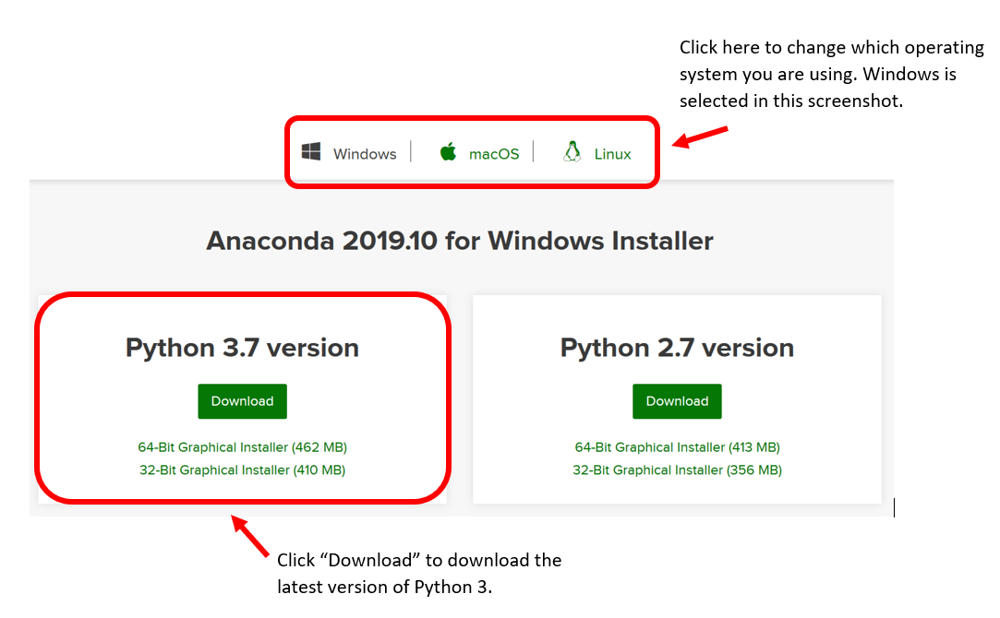
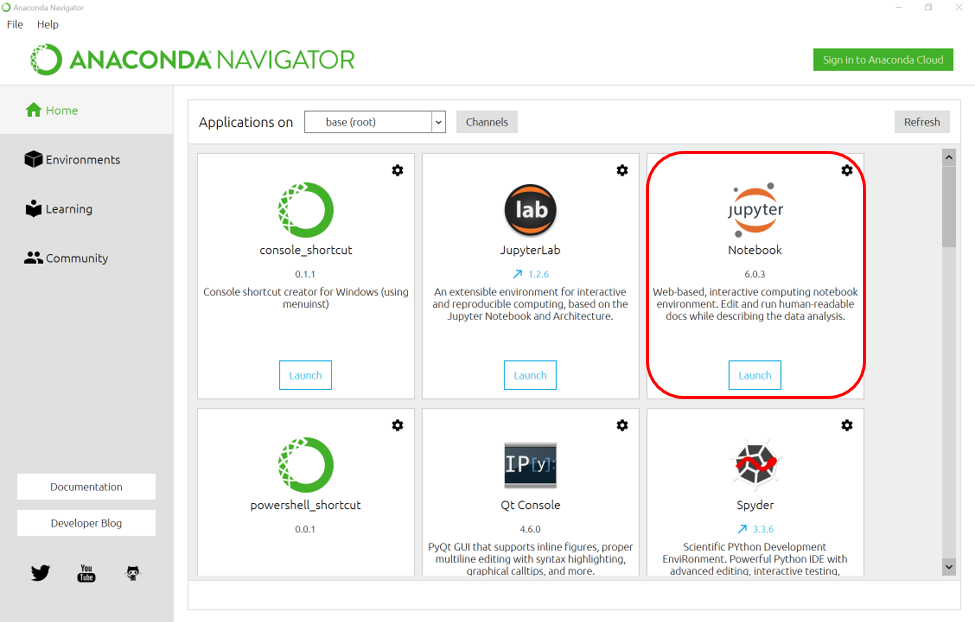
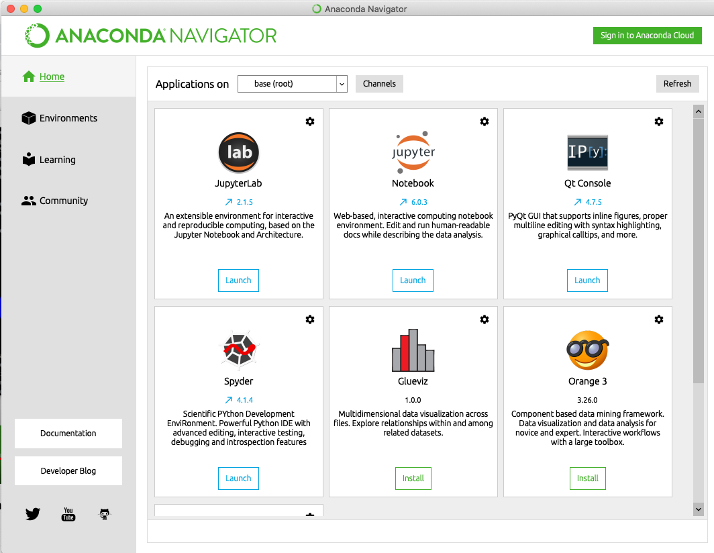

# Welcome to Geospatial Fundamentals in Python

## Overview

Geospatial data are an important component of data visualization and analysis in the social sciences, humanities, and elsewhere. The Python programming language is a great platform for exploring these data and integrating them into your research. 

### Geospatial Data in Python, part I: Getting started with spatial dataframes

Part one of this two-part workshop series will introduce basic methods for working with geospatial data in Python using the [GeoPandas library](https://geopandas.org). Participants will learn how to import and export spatial data and store them as GeoPandas GeoDataFrames (or spatial dataframes). We will explore and compare several methods for mapping the data including the GeoPandas plot function and the matplotlib library. We will review coordinate reference systems and methods for reading, defining and transforming these. Note, this workshop focuses on vector spatial data.

### Geospatial Data in Python, part 2: Geoprocessing and analysis

Part two of this two-part workshop series will dive deeper into data driven mapping in Python, using color palettes and data classification to communicate information with maps. We will also introduce basic methods for processing spatial data, which are the building blocks of common spatial analysis workflows. Note, this workshop focuses on vector spatial data.


###  Pre-requisites

#### Knowledge Requirements
You'll probably get the most out of this workshop if you have a basic foundation in Python and Pandas, similar to what you would have from taking the D-Lab Python Fundamentals workshop series. Here are a couple of suggestions for materials to check-out prior to the workshop.

`D-Lab Workshops`:
 - [Python Fundamentals](https://github.com/dlab-berkeley/python-fundamentals)
 - [Pandas](https://github.com/dlab-berkeley/introduction-to-pandas)

`Other`:
 - [Learn Python on Kaggle](https://www.kaggle.com/learn/python)
 - [Programming in Python - Software Carpentry](http://swcarpentry.github.io/python-novice-inflammation/)
 - [Learn Pandas on Kaggle](https://www.kaggle.com/learn/pandas)
 - [Plotting in Python - Software Carpentry](http://swcarpentry.github.io/python-novice-gapminder/)
: Basic knowledge of geospatial data is expected. R experience equivalent to the D-Lab R Fundamentals workshop series is required to follow along with the tutorial. Knowledge of ggplot helpful.

#### Technology Requirements: 

Bring a laptop with Python and the following packages installed: pandas, geopandas, matplotlib, descartes and dependencies. More details are provided on the workshop github page https://github.com/dlab-berkeley/Geospatial-Fundamentals-in-Python).


## 1.0 Python and Jupyter Notebook installation 

There are many ways to install python and python libraries, distributed as packages, on your computer. Here is one way that we recommend.


* Anaconda installs IDEs and several important packages like NumPy, Pandas, and so on, and this is a really convenient package which can be downloaded and installed.

Anaconda is a free and open-source distribution of Python. Anaconda installs IDEs (integrated development environments, aka where you can write and run code) and several important packages like NumPy and Pandas, making it a really convenient package to use.

### 1.1 Download Anaconda:

Follow this link to download Anaconda: https://www.anaconda.com/distribution. The same link can be used for Mac, Windows, and Linux. 


We recommend downloading the latest version, which will be Python 3.

    
Open the .exe file that was downloaded and follow the instructions in the installation wizard prompt.

### 1.2 Launch Anaconda and open a Jupyter Notebook

Once installation is complete open Anaconda Navigator and launch Jupyter Notebook. 


Jupyter Notebook will open in your web browser (it does not require internet to work). In Jupyter, navigate to the folder where you saved the code file you plan to use and open the .ipynb file (the extension for Jupyter Notebook files written in Python) to view it in the Notebook.

## 2.0 Installing Geopandas

- From within Anaconda Navigator click on the `Environments` selection in the left sidebar menu
> 

- Click on the arrow to the right of your `base (root)` environment and select **Open Terminal** 

> 

- This will give you access to the command line interface (CLI) on your computer in a window that looks like this:

> 

- Install some needed software by entering the following commands, one at a time:

```
conda install python=3 geopandas
conda install juypter
conda install matplotlib
conda install descartes
conda install mapclassify
conda install contextily
```
Once you have those libraries all installed you will be able to go to Anaconda Navigator, launch a `Jupyter Notebook`, navigate to the workshop files and run all of the notebooks.


*Optionally you can create a virtual environment In the terminal window, type the **conda** commands shown on the [GeoPandas website](https://geopandas.org/install.html#creating-a-new-environment) for installing Geopandas in a virtual environment. These are:*

````
conda create -n geo_env
conda activate geo_env
conda config --env --add channels conda-forge
conda config --env --set channel_priority strict
conda install python=3 geopandas
````

*After creating your virtual environment, you can process and install the rest of your packages listed above. You will be able to select your `geo_env` in Anaconda Navigator.*


---
<div style="display:inline-block;vertical-align:middle;">
<a href="https://dlab.berkeley.edu/" target="_blank">
</a>
</div>

<div style="display:inline-block;vertical-align:middle;">
    <div style="font-size:larger">&nbsp;D-Lab @ University of California - Berkeley</div>
    <div>&nbsp;Team Geo<div>
</div>
      

